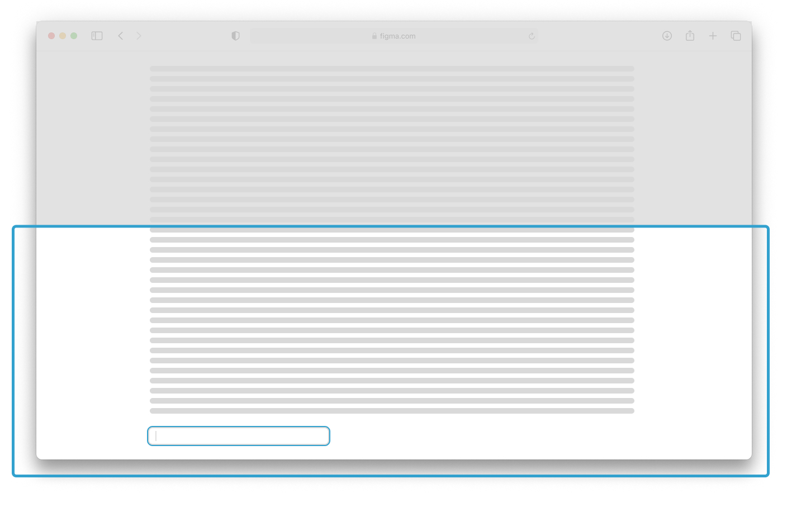

# Рекомендации по использованию автофокуса на полях ввода
Узнайте как правильнее использовать автофокус в веб-интерфейсах так, чтобы пользователь был счаслив.

## Что такое автофокус?
Автофокус - это когда курсор автоматически устанавливается в поле ввода при загрузке страницы.

## Общие правила
Достаточно усвоить следующие правила, чтобы не смотреть все проблемы и рекомендации ниже

Рекомендации:
- **Не используйте** автофокус для полей, которые находятся не на первом экране.
- **Не используйте** автофокус для полей в скрытых элементах, например модальное окно авторизации.
- **Не используйте** автофокус для полей, если задача стоит как снижение количество кликов.
- **Используйте** автофокус только для полей, если это первое требуемое действие от пользователя. Например, поиск по проекту или отдельная страницы авторизации/регистрации.

## Преимущества
### Интерфейс для поиска или заполнения данных
Дайте полю ввода автофокус, если первое обязательное действие которое требуется от вашего пользователя

Например:
- Поиск по странице/проекту;
- Авторизация;
- Заполнение оплаты;
- Опросы.

Авторизация может быть и в модальном окне, располагающееся по-отдельному урлу, если модальное окно перекрывает весь сайт и блокирует взаимодействие с остальным интерфейсом, то есть полностью забирает внимание на себя.

## Проблемы
### Страница неожиданно перескакивает к полю
При загрузке страницы курсор автоматически устанавливается в поле ввода, что приводит к тому, что страница прокручивается к этому полю. Это может быть неожиданно для пользователя, особенно если поле ввода находится внизу страницы. В этом случае пользователь пропускает часть контента.

### Перестает работать прокрутка страницы
При автофокусе перестаёт работать прокрутка страницы с помощью клавиш вверх `↑` и вниз `↓`.

### Невозможно вернуться назад
При автофокусе перестаёт работать переход на страницы с помощью `Command + ←` и `Command + →` на Mac.

### Скринридер читает не то, что нужно
При загрузке страницы скринридер начинает читать заголовок страницы, но внезапно переключается на поле ввода, что приводит к тому, что пользователь не может узнать, что находится на странице.

### Мобильная клавиатура может не работать
На Android мобильная клавиатура не открывается при автофокусе. Приходится делать клик на поле ввода, чтобы открыть клавиатуру.

### Не работает автозаполнение
При автофокусе не работает автозаполнение полей ввода, например, в браузере Chrome.

### Лишняя прокрутка
Если указан автофокус для поля, которое изначально скрыто, например, закрытое модальное окно с формой авторизации, то может появится лишний вертикальный или горизонтальный скрол.

### Плохо сделанное состояние поля
Лучше не использовать автофокус на поле у которого нет чётко выраженного состояния фокуса `:focus`, `:focus-visible`. С невыраженным состоянием фокуса поле потеряется на фоне остального интерфейса и ваш пользователь будет дезориентирован.

## Благодарности
[Adam Silver](https://adamsilver.io/) за статью «[The problem with automatically focusing the first input and what to do instead](https://adamsilver.io/blog/the-problem-with-automatically-focusing-the-first-input-and-what-to-do-instead/)», на которой основаны эти рекомендации.
